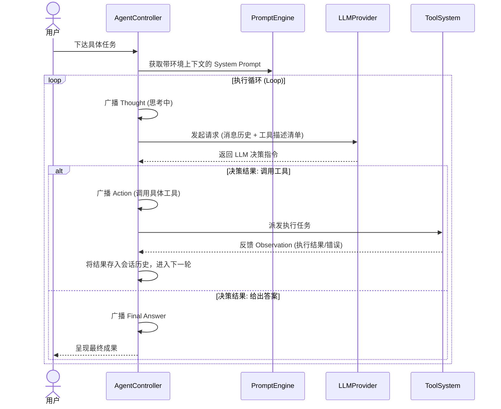

# P0：核心基础模块详细设计 (纯文本设计版)

本文档定义了 CodeAgent P0 阶段核心模块的功能架构与业务逻辑流。P0 阶段的目标是建立稳定、可靠的 **LLM → Tool → Result** 双向反馈循环。

## 1. LLM Engine (大模型引擎模块)

该模块作为系统的“通讯官”，负责屏蔽不同大模型厂商 (OpenAI, Anthropic, 智谱等) 的底层 API 差异。

### 1.1 核心职能
- **统一抽象 (Provider Interface)**：定义统一的模型调用契约，无论底层是哪个模型，上层调用者只需感知统一的响应格式。
- **消息协议封装**：将系统内部的通用 Message 结构（Role, Content, ToolCalls）转换为特定厂商支持的数据格式。
- **流式与非流式处理**：具备处理实时文本流 (Streaming) 和结构化 JSON 返回的能力。
- **参数动态热更**：支持在请求级别配置 Temperature、Max Tokens 等生成参数。

### 1.2 逻辑设计
- **Provider 路由机制**：支持根据配置动态加载不同的模型实例。
- **异常捕获预处理**：识别 API 层级的错误（如 401 鉴权失效、503 服务不可用），并封装为系统内部标准错误码。

---

## 2. Tool System (工具系统模块)

工具系统是 Agent 的“手臂”，负责将 LLM 的文本意图转化为对本地机系统的具体操作。

### 2.1 核心职能
- **工具描述符管理 (Metadata)**：每个工具必须具备唯一的名称、详尽的功能描述以及严密的入参规范。
- **参数自动化转义 (Schema Mapping)**：自动将工具内部定义的参数结构（如 Zod / JSON Schema）提取出来，提供给 LLM 进行“按图索骥”。
- **异步安全执行**：所有本地操作（IO、网络请求）均在异步环境执行，具备超时控制。
- **结果标准化反馈**：无论工具执行成功还是失败，都必须返回足以支撑 LLM 下一步决策的文本信息。

### 2.2 核心工具集 (P0 MVP)
- **读取工具 (ReadFile)**：支持传入文件路径，受控读取本地文本内容。
- **回显工具 (Echo)**：纯逻辑验证工具，用于测试 LLM 与工具系统间的往返连通性。

---

## 3. Prompt Engine (提示词引擎模块)

提示词引擎是 Agent 的“大脑意识”，负责构建决策逻辑的基准背景。

### 3.1 核心职能
- **动态环境感知**：自动采集运行时环境（OS、工作目录、系统架构等）并注入系统预设词。
- **ReAct 工作流规范**：强制约束 Agent 遵循“观察 -> 思考 -> 行动 -> 验证”的标准决策链，防止其盲目修改。
- **红线规则校验**：内置安全原则、行为边界和防死循环求援机制。
- **逻辑隔离**：将业务逻辑提示词与代码实现解耦，支持无需重改代码即可优化 Agent 的智力表现。

---

## 4. Agent Controller (流程控制枢纽)

Controller 是全系统的“心脏”，负责驱动整个 Agent Loop 循环，协调各模块间的协同。

### 4.1 核心职能
- **状态总线调度**：作为消息中心，对外广播 Agent 当前正处于哪个阶段（思考中、工具执行中、任务终结）。
- **递归循环调度**：维护 While 循环，根据 LLM 的意图决定是继续调用工具还是输出最终答案。
- **死循环硬性拦截**：设置最大迭代轮次 (Max Iterations)，在高频失败或逻辑无限循环时强制挂起，保护 Token 资产。
- **长短期记忆维护**：在当前任务周期内维护完整的消息历史，确保多轮工具调用的上下文连贯。

---

## 5. 核心模块交互时序流

---

## 6. 验证与健壮性设计

- **闭环验证标准**：通过“阅览指定文件并基于内容进行二次反馈”作为 P0 链路完成的硬性标准。
- **错误恢复逻辑**：如果工具执行失败，Controller 负责将错误描述转化为 LLM 能理解的自然语言，引导 LLM 尝试换一种参数或工具以通过自愈。
- **观测性设计**：通过系统化的事件监听模式，确保上层应用能实时感知 Agent 的内部心跳。
