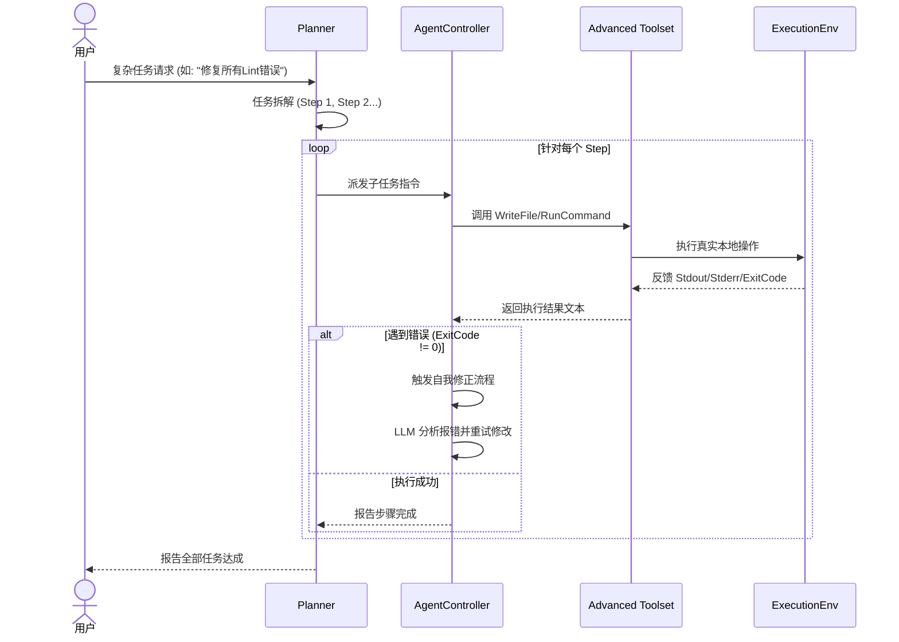

# P1：执行能力模块详细设计 (纯文本设计版)

在 P0 阶段跑通了基本的 LLM → Tool 闭环后，P1 阶段的核心目标是赋予 Agent 真实影响项目环境的“手脚”以及初步的“任务拆解大脑”。

## 1. 高级工具集 (Advanced Toolset) - **(已实现)**

P1 将在 P0 的基础上，引入两个具备“落地”能力的核心工具，使 Agent 从“只能看”变为“能动手”。

### 1.1 写文件工具 (WriteFileTool) - **(已实现)**
- **核心职能**：允许 Agent 在指定的路径创建或覆盖文件。
- **功能设计**：
  - **全量写入**：初期支持全量内容覆盖，简单可靠。
  - **路径安全校验**：**（已加固）** 强制路径必须位于工作区内，防止路径穿越。
  - **自动目录创建**：如果写入的路径包含不存在的文件夹，会自动递归创建。
  - **编码保障**：统一强制使用 UTF-8 编码。

### 1.2 命令执行工具 (RunCommandTool) - **(已实现)**
- **核心职能**：在本地 environment 执行 Shell 命令（如 `npm test`, `tsc`, `ls` 等）。
- **功能设计**：
  - **标准输入输出捕获**：完整捕获 `stdout` 和 `stderr`。
  - **智能输出截断**：当输出超过 10,000 字符时，自动保留头部和尾部各 40%。
  - **超时拦截**：设置默认超时时间（如 30s）。

### 1.3 增强型工具集 (Enhanced Tools) - **(已实现)**
- **ListDirectoryTool**：结构化列出目录内容（JSON 格式），替代对外部 `ls/dir` 的依赖。
- **FileSearchTool**：全局文本关键字搜索，支持快速定位代码。
- **ReplaceContentTool**：精准局部文本替换，大幅减少全量写入的 Token 开销。

---

## 2. 执行环境 (Execution Environment) - **(已实现)**

执行环境是 RunCommandTool 的底层支撑，负责具体的进程调度。

### 2.1 核心职能
- **进程管理**：管理子进程的启动、监控与销毁。
- **输出流监听**：实时监听进程输出，并在输出量过大时进行智能截断，防止大模型上下文溢出。
- **退出码感知**：识别命令状态码（Exit Code），0 为成功，非 0 则自动触发系统的“自我修正”逻辑。

---

## 3. 任务规划器 (Planner) - **(已实现)**

当用户输入复杂任务（如：“帮我重构所有 API 接口并跑通测试”）时，单次模型调用无法处理。Planner 负责将“大象”装进冰箱的步骤拆解。

### 3.1 核心职能
- **大任务拆解 (Decomposition)**：分析用户目标，输出有序的任务列表。
- **上下文连续性 (Context Continuity)**：**（已强化）** 规划器现在会维护跨步骤的对话历史。Agent 在执行后续步骤时能回想起之前步骤中读到的信息。
- **执行进度跟踪**：实时记录每个步骤的完成情况。
- **动态修正计划**：如果某一步骤发生失败，Planner 会调用 LLM 根据失败原因生成“修正计划”，自动调整后续路径。

---

## 4. 自我修正闭环 (Self-Correction Loop) - **(已实现)**

P1 阶段最有价值的逻辑提升。

### 4.1 业务流程
1. **行动 (Act)**：Agent 根据计划修改代码内容。
2. **验证 (Verify)**：自动调用 `RunCommandTool` 执行编译或测试命令。
3. **反馈 (Feedback)**：
   - 如果执行成功（Exit Code 0），则进入下一个 Planner 步骤。
   - 如果执行失败（Exit Code 非 0），则将 `stderr` 的报错日志原封不动地喂回给 LLM。
4. **修正 (Correct)**：LLM 根据报错信息（如：第 10 行语法错误）重新调用写工具进行修复，直至验证通过。

---

## 5. P1 阶段交互时序增强图

---

### 6. 入口与交互 (Entry & Interaction) - **(已实现)**

- **CLI 入口 (`src/index.ts`)**：提供交互式命令行界面，支持多轮对话。
- **模式切换**：支持 `--plan` 参数开启任务规划模式，适应复杂业务流。
- **测试工程化 (`src/tests/`)**：
  - `agent-test.ts` (基础 ReAct 能力验证)
  - `planner-test.ts` (任务分解与执行链路验证)
  - `comprehensive-test.ts` (全量集成测试：涵盖**路径安全**、**多步记忆**与**故障重规划**)
- **一键测试**：通过 `npm test` 或 `npm run test:all` 运行全量集成验证。
- **测试产物隔离**：所有测试生成的临时文件统一存放于 `temp/` 目录。
